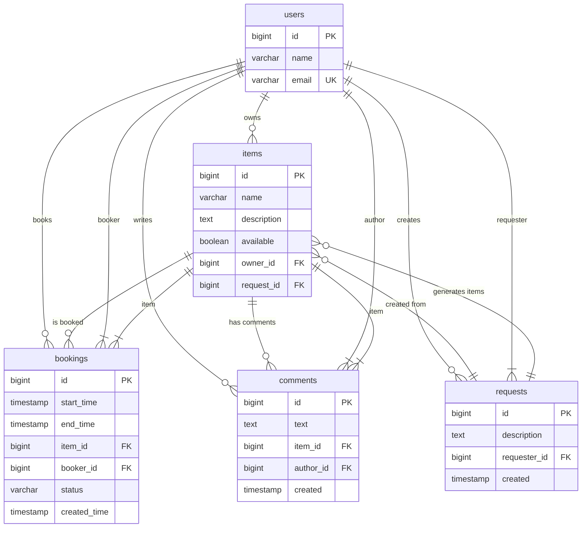

ShareIt - Сервис для шеринга вещей
📋 Описание проекта
ShareIt - это платформа для совместного использования вещей (шеринг), позволяющая пользователям брать 
в аренду предметы у других пользователей и делиться своими вещами. 
Сервис решает проблему хранения редко используемых вещей и предоставляет доступ к необходимым предметам 
без необходимости покупки.

🎯 Основные возможности
Для владельцев вещей:
📦 Добавление вещей - публикация предметов для аренды

📊 Управление доступностью - возможность отмечать вещи как доступные/недоступные

📋 Просмотр заявок - управление бронированиями своих вещей

⭐ Отзывы - получение обратной связи от арендаторов

Для арендаторов:
🔍 Поиск вещей - поиск нужных предметов по названию и описанию

📅 Бронирование - создание заявок на аренду вещей

📝 Запросы - создание запросов на вещи, которых нет в системе

💬 Отзывы - оставление комментариев после использования

Системные функции:
📋 Управление бронированиями - система подтверждения/отклонения заявок

🔔 Статусы бронирований - WAITING, APPROVED, REJECTED, CANCELED

⏰ Контроль дат - предотвращение пересечения бронирований

🔍 Расширенный поиск - поиск с фильтрацией по доступности и датам

# Схема базы данных (ER-диаграмма)

